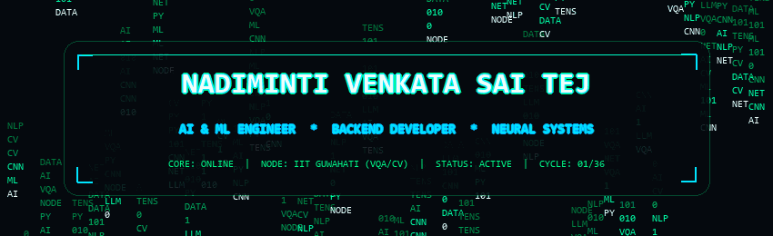
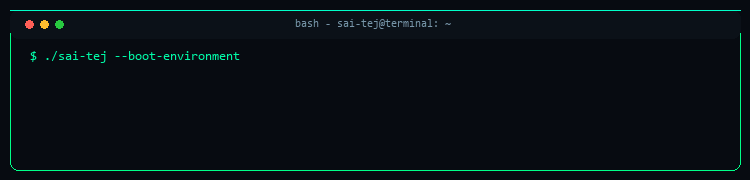
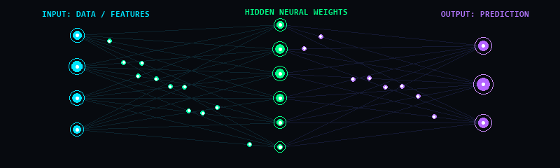
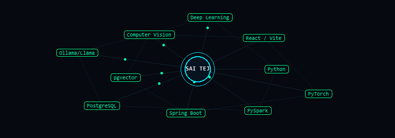
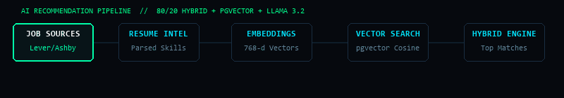
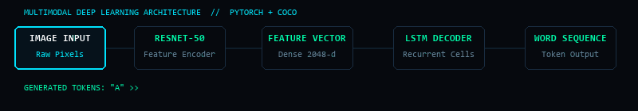
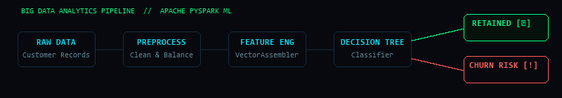



<!-- ═══════════════════════════════════════════════════════════════════════ -->
<!--                       CINEMATIC HERO BANNER                            -->
<!-- ═══════════════════════════════════════════════════════════════════════ -->

  

<!-- ANIMATED TYPING SUBTITLE -->

 

<!-- STATUS PILLS -->

  
  &nbsp;
  
  &nbsp;
  
  &nbsp;
  

<!-- SOCIAL BUTTONS -->

  
  &nbsp;
  
  &nbsp;
  

<!-- ═══════════════════════════════════════════════════════════════════════ -->
<!--                       SYSTEM BOOT TERMINAL                             -->
<!-- ═══════════════════════════════════════════════════════════════════════ -->

  

  

<!-- ═══════════════════════════════════════════════════════════════════════ -->
<!--                         ABOUT THE ENGINEER                             -->
<!-- ═══════════════════════════════════════════════════════════════════════ -->

### `// 01. PROFILE SPECIFICATIONS`

> **AI & Machine Learning Engineer** specializing in Deep Learning, Computer Vision, and scalable Backend Architecture. Currently building intelligent multimodal systems and high-dimensional vector search pipelines.

- 🎓 **Education:** B.Tech in Computer Science & Engineering (**AI & ML Specialization**) at **Centurion University of Technology and Management** (CGPA: **8.7 / 10.0**)
- 🔬 **Active Research:** AI/ML Research Intern at **IIT Guwahati** — developing **Visual Question Answering (VQA)** and **Video Captioning** architectures using deep learning
- 📍 **Location:** Vizianagaram, Andhra Pradesh, India
- ⚡ **Core Focus:** Neural Systems • Computer Vision • NLP & LLMs • Generative AI • Vector Search • Distributed ML
- 🎯 **Commitment:** *"Stays committed to solving challenges and delivering quality results."*

  

<!-- ═══════════════════════════════════════════════════════════════════════ -->
<!--                     NEURAL NETWORK ARCHITECTURE                        -->
<!-- ═══════════════════════════════════════════════════════════════════════ -->

### `// 02. NEURAL NETWORK ARCHITECTURE & DATA FLOW`

  <em>Live signal transmission across neural layers: Raw inputs to high-dimensional representation to inference.</em>

  

  

<!-- ═══════════════════════════════════════════════════════════════════════ -->
<!--                     TECHNOLOGY CONSTELLATION                           -->
<!-- ═══════════════════════════════════════════════════════════════════════ -->

### `// 03. TECHNOLOGY CONSTELLATION & STACK`

  <em>Dynamic knowledge graph mapping core AI/ML systems, backend infrastructure, and tooling.</em>

  

 

#### 💻 Programming Languages

  
  
  

#### 🧠 Artificial Intelligence & Machine Learning

  
  
  
  
  
  
  
  
  

#### ⚙️ Backend Engineering & Web

  
  
  
  
  
  

#### 🗄️ Database & Vector Infrastructure

  
  
  
  
  
  

#### 📊 Data Science & Preprocessing

  
  
  
  

#### 🛠️ Developer Environment & Tools

  
  
  
  
  

  

<!-- ═══════════════════════════════════════════════════════════════════════ -->
<!--                       FEATURED PROJECTS                                -->
<!-- ═══════════════════════════════════════════════════════════════════════ -->

### `// 04. FEATURED PRODUCTION-GRADE SYSTEMS`

---

#### 🚀 FLAGSHIP: Career Intelligence — Personalized Job Platform
> **AI-powered job discovery engine** aggregating live postings from Greenhouse, Lever, and Ashby. Combines an 80/20 hybrid recommendation engine with 768-dimensional dense vector embeddings in `pgvector` and local `Llama 3.2` enrichment for contextual match precision.

  

- **Core Capabilities:** Skill matching, career-level alignment, work-mode classification, location matching, semantic vector cosine similarity, and feedback-based adaptive re-ranking.
- **Tech Stack:** `Java` • `Spring Boot` • `React` • `Vite` • `Tailwind CSS` • `PostgreSQL` • `pgvector` • `Ollama` • `Llama 3.2`
- **Repository:** 

---

#### 🖼️ PROJECT 02: Image Captioning using CNN–LSTM Architecture
> **Multimodal deep learning vision-to-language system** trained on the COCO dataset. Leverages a pretrained ResNet-50 backbone as a convolutional feature encoder paired with a recurrent LSTM decoder for natural language sentence synthesis.

  

- **Core Capabilities:** Vocabulary construction, tokenization, sequence batching, feature extraction, and real-time autoregressive caption inference for unseen images.
- **Tech Stack:** `Python` • `PyTorch` • `ResNet-50` • `LSTM` • `COCO Dataset` • `Computer Vision` • `NLP`

---

#### 📊 PROJECT 03: Customer Churn Prediction using Apache PySpark
> **Distributed machine learning pipeline** engineered to predict customer churn patterns on large-scale enterprise datasets using distributed Decision Tree classification.

  

- **Core Capabilities:** Distributed data ingestion, exploratory data analysis, class balancing, feature vector assembly via `VectorAssembler`, model training, cross-validation, and churn risk segmentation.
- **Tech Stack:** `PySpark` • `Apache Spark` • `Decision Tree Classifier` • `Machine Learning` • `Feature Engineering`

  

<!-- ═══════════════════════════════════════════════════════════════════════ -->
<!--                     CERTIFICATIONS & HONORS                            -->
<!-- ═══════════════════════════════════════════════════════════════════════ -->

### `// 05. CERTIFICATIONS & ACHIEVEMENTS`

<table width="100%">
  <tr>
    <td width="50%" valign="top">
      <h4>🏆 Verified Certifications</h4>
      <ul>
        <li><strong>Microsoft SQL Certification</strong> — <em>Intellipaat</em></li>
        <li><strong>Google AI Professional Certificate</strong> — <em>Google | Coursera</em></li>
        <li><strong>Qiskit Global Summer School 2026</strong> — <em>Quantum Excellence | IBM Credly</em></li>
        <li><strong>Machine Learning with PySpark: Churn Analysis</strong> — <em>Coursera</em></li>
      </ul>
    </td>
    <td width="50%" valign="top">
      <h4>🏅 Recognitions & Metrics</h4>
      <ul>
        <li>
          <strong>Monthly Coding Marathon — Certificate of Achievement (July 2026)</strong> 
          <em>Honored for rigorous problem-solving, focus, and sustained coding performance.</em>
        </li>
        <li>
          <strong>Social Media Content Creator (3K+ Followers)</strong> 
          <em>Built and scaled a motivation and mindset account with 3,000+ followers through high-engagement digital content.</em>
        </li>
      </ul>
    </td>
  </tr>
</table>

  

<!-- ═══════════════════════════════════════════════════════════════════════ -->
<!--                       GITHUB ANALYTICS                                 -->
<!-- ═══════════════════════════════════════════════════════════════════════ -->

### `// 06. GITHUB ANALYTICS & TELEMETRY`

  
  &nbsp;&nbsp;
  

    

  

    

  

  

<!-- ═══════════════════════════════════════════════════════════════════════ -->
<!--                           CONNECT                                      -->
<!-- ═══════════════════════════════════════════════════════════════════════ -->

<h2>Let's Build Something Intelligent.</h2>

  Open for AI/ML engineering collaborations, research initiatives, and backend systems development.

&nbsp;

&nbsp;

  

<!-- CINEMATIC FOOTER ANIMATION -->

